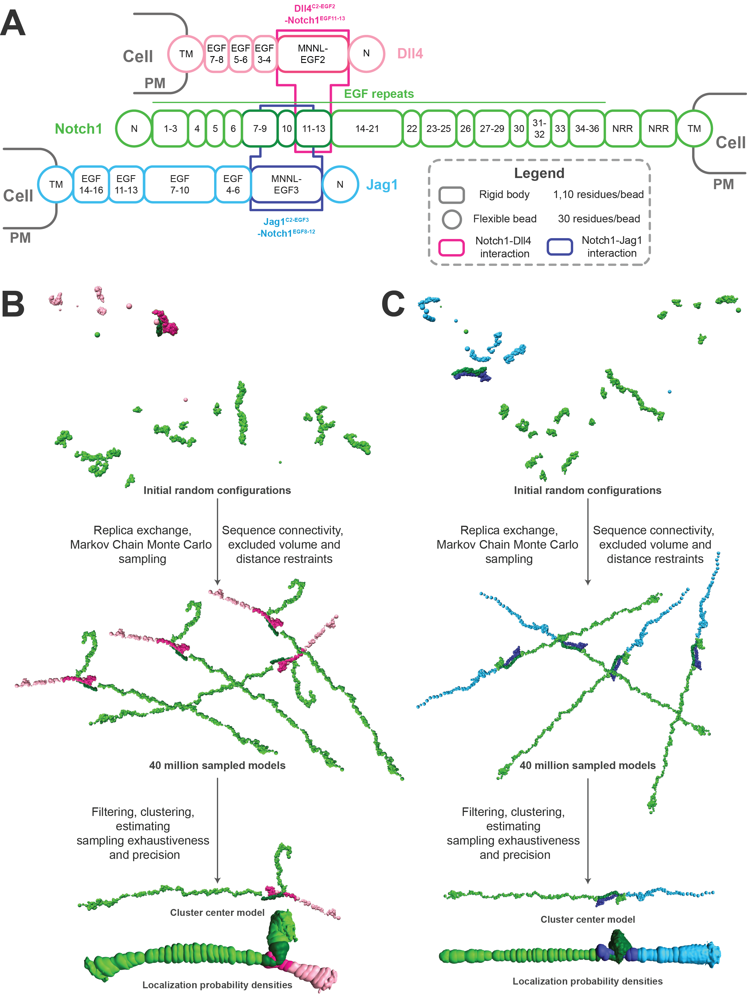

# Integrative modeling of Notch-ligand complexes 

This repository is of the integrative model of Notch-ligand complexes based on data from X-ray crystallography, NMR, Ca2+ binding experiments, homology modeling, and stereochemistry. It contains input data, scripts for modeling and results including bead models and localization probability density maps. The modeling was performed using [IMP](https://integrativemodeling.org) (*Integrative Modeling Platform*).



## Directory structure
1. [inputs](inputs/) : contains the subdirectories for the input data used for modeling all the subcomplexes.
2. [scripts](scripts/) : contains all the scripts used for modeling and analysis of the models.
3. [results](results/) : contains the models and the localization probability densities of the top cluster of the subcomplexes.

### Simulations
These are the independent simulations:
1. Modeling of Notch1-DLL4 complex : `dll4`
2. Modeling of Notch1-JAG1 complex : `jag1`

## Protocol
### Sampling
To run the sampling, run modeling scripts like this 
```
for runid in `seq 1 NRUNS` ; do mpirun -np NCORES $IMP python scripts/modeling_COMPLEXNAME_rigid.py prod $runid ; done
```

where, \
`$IMP` is the setup script corresponding to the IMP installation directory (omit for binary installation), \
`COMPLEXNAME` is `dll4`, `jag1`   \
`NRUNS` is the number of runs, \
and `NCORES` is the number of cores on which replica exchange is to be carried out.


### Analysis
#### 1. Getting the good scoring models
  Good scoring models were selected using `pmi_analysis` (Please refer to [pmi_analysis tutorial](https://github.com/salilab/PMI_analysis) for more detailed explaination) along with our `variable_filter_COMPLEXNAME.py` script. These scripts are run as described below:
  1. First, run `run_analysis_trajectories.py` as follows:\
      `$IMP run_analysis_trajectories.py modeling run_ `\
      where, `$IMP` is the setup script corresponding to the IMP installation directory (omit for binary installation), \
      `modeling` is the directory containing all the runs and \
      `run_` is the prefix for the names of individual run directories.
      

  2. Then run `variable_filter_COMPLEXNAME.py` on the major cluster obtained as follows: \
      `$IMP variable_filter_COMPLEXNAME.py -c N -g MODEL_ANALYSIS_DIR`
      where, `$IMP` is the setup script corresponding to the IMP installation directory (omit for binary installation), \
      `N` is the cluster number of the major cluster, \
      `MODEL_ANALYSIS_DIR` is the location of the directory containing the selected_models*.csv.   
  _Please also refer to the comments in the `variable_filter_COMPLEXNAME.py` for more details._

  3. The selected good scoring models were then extracted using `run_extract_good_scoring_models.py` as follows: \
      `$IMP python run_extract_good_scoring_models.py modeling run_ CLUSTER_NUMBER` \
      where, `$IMP` is the setup script corresponding to the IMP installation directory (omit for binary installation), \
      `modeling` is the path to the directory containing all the individual runs and \
      `CLUSTER_NUMBER` is the number of the major cluster to be extracted.
      

#### 2. Running the sampling exhaustiveness tests (Sampcon)
A separate directory named `sampcon` was created and a `density_COMPLEXNAME.txt` file was added to it. This file contains the details of the domains to be split for plotting the localisation probability densities. Finally, sampling exhaustiveness tests were performed using `imp-sampcon`. 


#### 3. Analysing the major cluster
* Contact maps were plotted for the models as follows: `scripts/COMPLEXNAME/contact_maps_notch_COMPLEXNAME.py` \
    _Please use `--help` script for more details._ 
* One can also run the `scripts/contact_map_prettify.py` after this. 


### Results

For each of the simulations, the following files are in the [results](results/) directory
* `cluster_center_model.rmf3` : representative bead model of the major cluster
* `chimera_densities.py` : to view the localization densities (.mrc files)


### Information
**Author(s):** Arastu Pandey, Shreyas Arvindekar, Shruthi Viswanath\
**Date**: \
**License:** [CC BY-SA 4.0](https://creativecommons.org/licenses/by-sa/4.0/)
This work is licensed under the Creative Commons Attribution-ShareAlike 4.0
International License.\
**Last known good IMP version:** [](https://integrativemodeling.org/systems/) \
**Testable:** Yes\
**Parallelizeable:** Yes\
**Publications:** S. Rathore, D. Gahlot, J. Castin, A. Pandey, S. Arvindekar, S. Viswanath, L. Thukral, _Multiscale simulations reveal architecture of NOTCH protein and ligand specific features_, Biophysical Journal, 124, 1-15, 2025. doi: https://doi.org/10.1016/j.bpj.2024.12.014 
